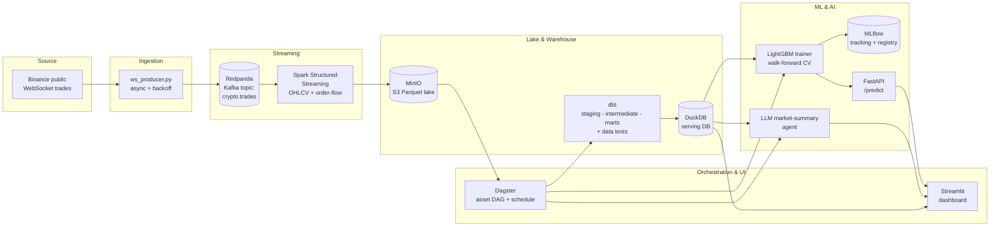

# CryptoStream — Architecture

## System diagram



## Skill coverage (why this project works for four job families)

| Job family | What in this repo demonstrates it |
|---|---|
| **Data Engineering** | Kafka/Redpanda ingestion, Spark Structured Streaming, MinIO S3 data lake, Dagster orchestration, Dockerized services |
| **Data Analytics** | dbt models (staging → intermediate → marts), data-quality tests, technical indicators, Streamlit BI dashboard |
| **Data Science** | Feature engineering, walk-forward time-series validation, LightGBM classifier, MLflow experiment tracking |
| **AI / ML** | Model serving via FastAPI, model reload/monitoring hooks, LLM market-summary agent (RAG-style over live stats) |

## Data contracts

**Kafka topic `crypto.trades`** (one JSON message per trade):

```json
{
  "symbol": "btcusdt",
  "trade_id": 12345,
  "price": 62000.5,
  "quantity": 0.01,
  "trade_time": 1700000000000,
  "is_buyer_maker": false,
  "ingest_time": 1700000000050
}
```

**Feature table `features/ohlcv_10s`** (10-second bars per symbol): open, high, low,
close, volume, vwap, trade_count, net_signed_volume, order_flow_imbalance.

**ML mart `marts.mart_ml_features`**: feature vector + `label_up_3` (1 if the close 3
bars / ~30s ahead is higher than the current close).

## Two ways to run

1. **Offline demo (fastest, no Docker/network):** `make seed` generates realistic
   synthetic bars → `make dbt` → `make train` → `make api` + `make dashboard`.
2. **Full live stack:** `make up` starts Redpanda, MinIO, Spark, MLflow, the API and
   dashboard in Docker; the ingestion service streams live Binance trades. Run the
   Dagster batch layer (`dagster dev`) to build marts + retrain on a schedule.
